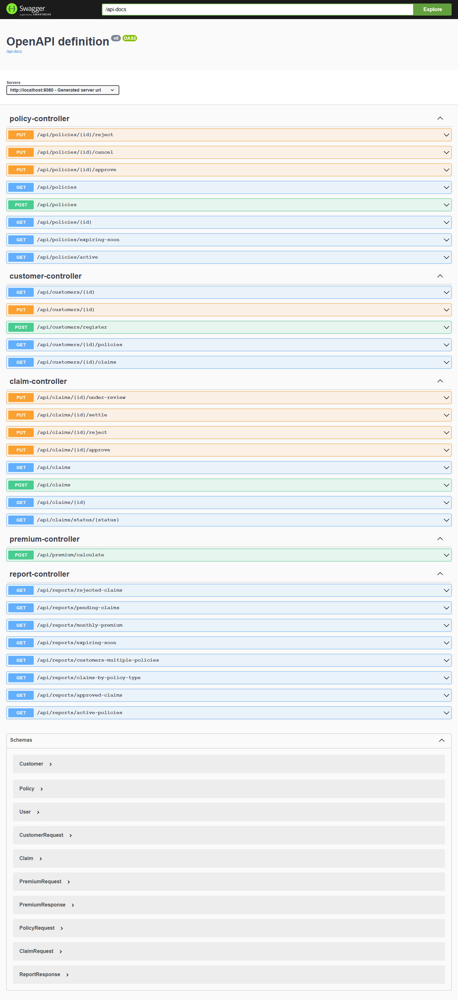
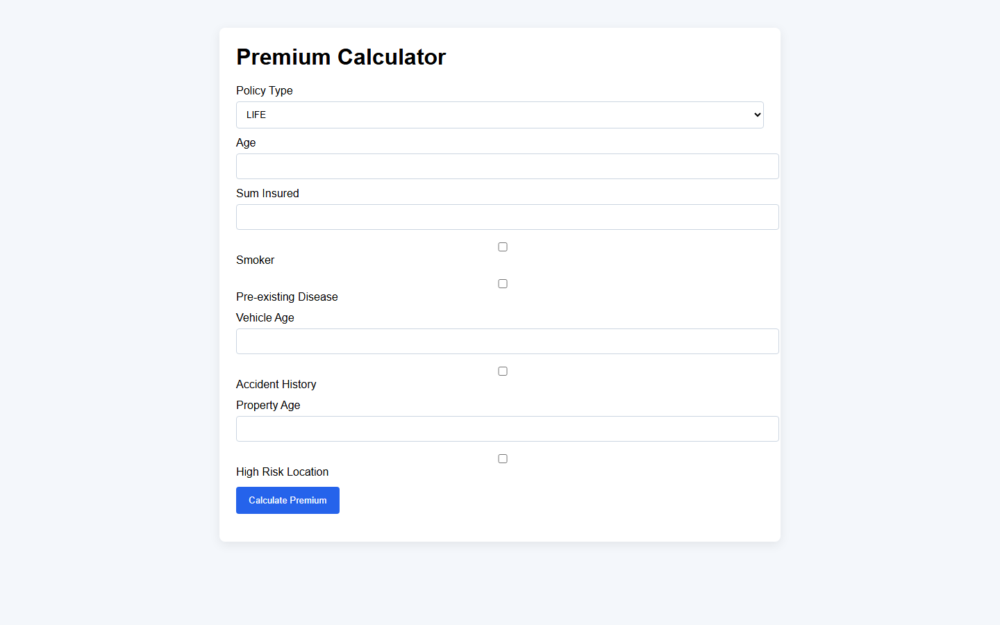
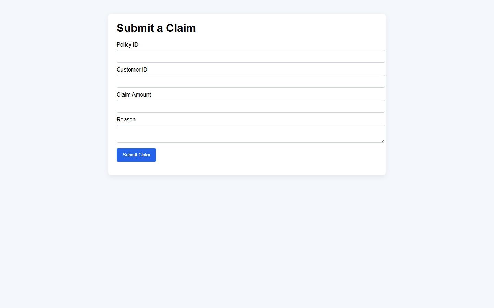
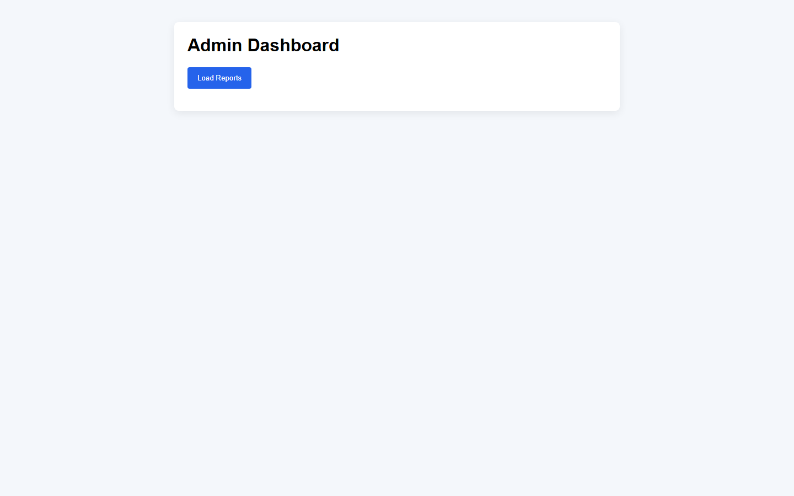
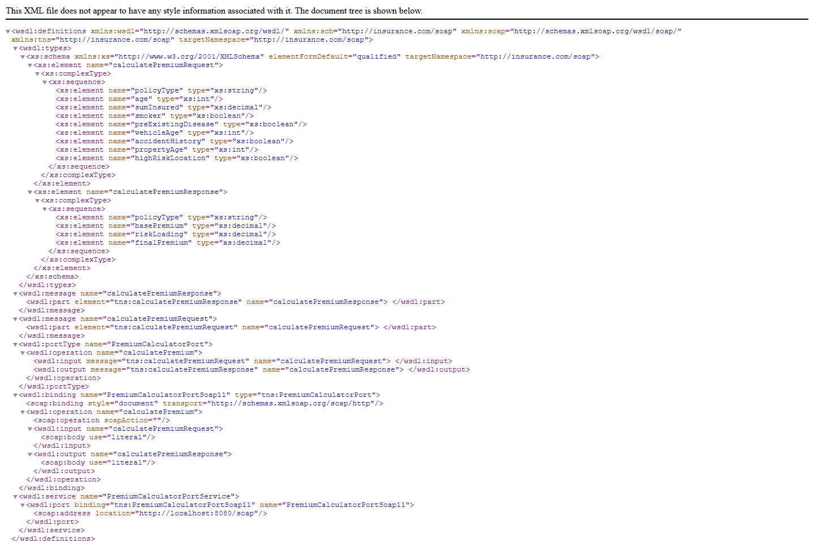

# Insurance Policy & Claims Management System

[](https://github.com/Prathyusha2909/insurance-management-system/actions/workflows/maven.yml)

## Overview
A Java Spring Boot insurance management system that supports customer registration, policy lifecycle, premium calculations, claims workflows, SQL-based reporting, REST APIs, and SOAP premium service.

## Features
- Customer registration and profile management
- Policy creation, approval, rejection, cancellation, expiring soon reports
- Premium calculation for Life, Health, Vehicle, Property policies
- Claim submission, review, approval, rejection, settlement
- Report APIs for active policies, pending claims, monthly premium, claims by type
- Swagger API documentation
- SOAP web service for premium calculation
- Unit tests with JUnit and Mockito

## Tech Stack
- Java 17
- Spring Boot
- Spring Data JPA
- Spring Web and Spring Web Services
- PostgreSQL for development, H2 for unit/integration tests
- Maven
- Swagger/OpenAPI
- HTML/CSS/JavaScript frontend

## Run Locally
1. Build:
   - macOS/Linux: `./mvnw clean package`
   - Windows: `.\mvnw.cmd clean package`
2. Start with H2 for local preview:
   - macOS/Linux: `./mvnw spring-boot:run -Dspring-boot.run.profiles=local`
   - Windows: `.\mvnw.cmd spring-boot:run -Dspring-boot.run.profiles=local`
3. Access:
   - Swagger: http://localhost:8080/swagger-ui.html
   - Frontend: http://localhost:8080/index.html

## Configuration
This project uses PostgreSQL in the `dev` profile and H2 only for tests.
- Primary config: `src/main/resources/application.properties`
- PostgreSQL dev config: `src/main/resources/application-dev.properties`
- Test config: `src/test/resources/application-test.properties`

### PostgreSQL example
```
spring.datasource.url=jdbc:postgresql://localhost:5432/insurance_db
spring.datasource.username=postgres
spring.datasource.password=your_password
spring.datasource.driver-class-name=org.postgresql.Driver
spring.jpa.properties.hibernate.dialect=org.hibernate.dialect.PostgreSQLDialect
```

## SOAP Endpoint
Base SOAP location: http://localhost:8080/soap/premiumCalculator.wsdl

## Screenshots
### Swagger UI


### Premium Calculator page


### Claim Submission page


### Admin Reports page


### SOAP WSDL / SOAP request


## Notes
This project uses layered architecture with controllers, services, repositories, DTOs, and SOAP integration.
